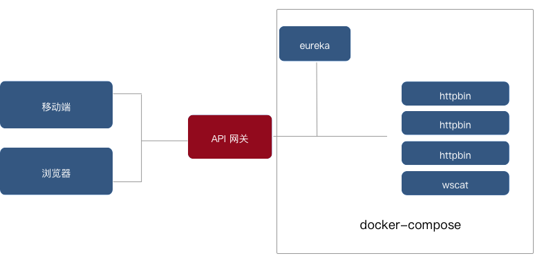

## 摘要

本文工程化角度，逐步介绍如何基于 spring-cloud-gateway 的网关服务。 


- basic-01 基本的网关反向代理功能 
- basic-02 网关代理WebSocket 的功能
- basic-03 网关的服务发现功能
- basic-04 网关的过滤器功能
- basic-05 网关的二次开发功能
- basic-06 网关的鉴权集成

以下demo会逐渐往这个架构靠拢：



## 基本运行环境

1. 安装了 docker docker-compose  
2. jdk 8 +
3. 安装了 wscat
4. 安装 maven （可选）
5. 安装了 curl 或者 **HTTPie**

## 1. 基本的网关反向代理功能

进入工程 `basic-01` ：

1. 进入 `src/main/docker` 
2. 执行`docker-compose up` ， 成功启动之后可以在浏览器访问 `http://localhost:10180/`， 可以看到httpbin 
3. 新开命令行终端进入`basic-01`，执行 `./mvnw spring-boot:run` 运行基本网关；
4. 成功启动之后可以在浏览器访问 `http://localhost:8080/` 通过网关反向代理到 httpbin 服务。

基本配置信息如下：

```java
spring:
  cloud:
    gateway:
      default-filters:
        - PrefixPath=/
        - AddResponseHeader=Info, basic-01 for httpbin
      routes:
        - id: default_path_to_httpbin
          uri: http://localhost:10180
          predicates:
            - Path=/**
```

如果通过命令 `http :8080/get`，可以看到如下响应：

```java
HTTP/1.1 200 OK
Access-Control-Allow-Credentials: true
Access-Control-Allow-Origin: *
Content-Length: 394
Content-Type: application/json
Date: Mon, 10 Feb 2020 08:56:42 GMT
Info: basic-01 for httpbin
Server: gunicorn/19.9.0

{
    "args": {},
    "headers": {
        "Accept": "*/*",
        "Accept-Encoding": "gzip, deflate",
        "Content-Length": "0",
        "Forwarded": "proto=http;host=\"localhost:8080\";for=\"0:0:0:0:0:0:0:1:51395\"",
        "Host": "localhost:10180",
        "User-Agent": "HTTPie/1.0.2",
        "X-Forwarded-Host": "localhost:8080"
    },
    "origin": "0:0:0:0:0:0:0:1",
    "url": "http://localhost:8080/get"
}
```

spring-cloud-gateway 帮忙我们做了以下事情：

1. 通过全局过滤器（GlobalFilter）添加响应头： `Info: basic-01 for httpbin` （见 application.yml 的 `spring.cloud.gateway. default-filters.#AddResponseHeader`）
2. 将`/**` 路径的请求，反向代理给 `localhost:10180`

## 2. 网关代理WebSocket 的功能

在进入这一章节，之前需要准备 wscat，用于模拟WebSocket 的服务端与客户端。

在命令行通过 `npm i -g wscat` (是的，没错，必须先安装 node）

完成安装之后，可以通过如下命令模拟一个WebSocket 服务端, 它会创建一个简单 echo 字符串的Web Socket 服务器：

`wscat --listen 9000`

启动之后，通过 `wscat --connect  ws://localhost:9000`  可以模拟客户端。


完成准备之后，关闭**wscat** 的进程避免端口占用情况发生。我们接下进入正题，请切换路径到 `basic-02`：

1. 命令行终端进行根目录，执行 `./mvnw spring-boot:run` 运行基本网关
2. 命令终端进入 `src/main/docker/script` 执行 `./web-socket-server` 运行Web Socket服务端 （终端2）
3.  命令终端进入 `src/main/docker/script` 执行 `./web-socket-client` 运行Web Socket客户端（终端3）

完成服务准备：

1. 在 **终端3** 输入 **hello**， 在 **终端2** 将看到打印 **hello**
2. 在 **终端2** 输入 **world**，在 **终端3**  将看到打印 **world**

查看 `src/main/resources/application.yml` 了解如何简单配置，支持**WebSocket**。

```java
spring:
  cloud:
    gateway:
      default-filters:
        - PrefixPath=/
        - AddResponseHeader=X-Response-Default-Foo, Default-Bar
      routes:
        - id: websocket_test
          uri: ws://localhost:9000
          order: 9000
          predicates:
            - Path=/echo
```

这里有一个问题，可以让大家思考下： 


1.  WebSocket 的代理，**default-filters** 是否生效？
2. AddRequestHeaderGatewayFilterFactory是否会转发给下游服务器？

## 3. 网关的服务发现功能

我们的demo 整体架构如下图：


工程 `basic-03` 需要修改java代码：

1. 在**pom.xml** 中增加 `spring-cloud-starter-netflix-eureka-client`
2. 在**com.quantex.gateway.GatewayApplication** 增加 `@EnableDiscoveryClient`
3. 使用默认配置访问eureka ：http://localhost:8761/
4. 修改 `src/main/resources/application.yml` ，增加路由： `/**` 路由到 `lb://httpbin`

以上修改由于篇幅的问题，不在此处罗列，具体想了解可以阅读git仓库。

这个过程验证如下：

1. 命令终端进入 `src/main/docker` 执行 `docker-compose up` 运行eureka, httpbin 服务
2.  命令终端进入 `src/main/docker/script` 执行 `./eureka-client` 将 httpbin 注册进入 eureka
3. 命令行终端进行根目录，执行 `./mvnw spring-boot:run` 运行基本网关

通过以上命令，我们的验证方法，请参考：`1. 基本的网关反向代理功能`。


## 4. 网关的过滤器功能

在开始使用网关的过滤器功能，我们先来了解下**spring-cloud-gateway**为我们提供了那些过滤器，下面这张图形象罗列出来大概有哪些过滤器，都是实现了 GatewayFilter （可能版本比较老，不够准确）


在包 **org.springframework.cloud.gateway.filter** 下面集中了spring-cloud-gateway提供的过滤器，将它们整理成表格如下，请阅：

过滤器|作用
-----:|:-------
AddRequestHeaderGatewayFilterFactory|在请求对象中添加请求头
AddRequestParameterGatewayFilterFactory|在请求对象中添加查询字符串
AddResponseHeaderGatewayFilterFactory|在响应头中添加响应头
DedupeResponseHeaderGatewayFilterFactory|去除重复的响应头
FallbackHeadersGatewayFilterFactory|在响应头添加异常信息
MapRequestHeaderGatewayFilterFactory|在请求对象中对请求头别名
PrefixPathGatewayFilterFactory|在请求对象中给请求uri增加路径前缀
PreserveHostHeaderGatewayFilterFactory|NettyRoutingFilter中会将请求头全部保留，转发给上游服务器
RedirectToGatewayFilterFactory|重定向过滤器，将请求重定向到指定url
RemoveRequestHeaderGatewayFilterFactory|在请求对象中移除请求头
RemoveRequestParameterGatewayFilterFactory|在请求对象中移除请求参数
RemoveResponseHeaderGatewayFilterFactory|在响应头中移除响应头
RequestHeaderSizeGatewayFilterFactory|限制请求头的字节数
RequestHeaderToRequestUriGatewayFilterFactory|暂时未知作用
RequestRateLimiterGatewayFilterFactory|限流过滤器，通过redis lua 脚本实现的
RequestSizeGatewayFilterFactory|限制的字节数
RetryGatewayFilterFactory|基于reactor 的retry
RewriteLocationResponseHeaderGatewayFilterFactory|
RewritePathGatewayFilterFactory|
RewriteResponseHeaderGatewayFilterFactory|
SaveSessionGatewayFilterFactory|
SecureHeadersGatewayFilterFactory|
SetPathGatewayFilterFactory|
SetRequestHeaderGatewayFilterFactory|
SetResponseHeaderGatewayFilterFactory|
SetStatusGatewayFilterFactory|
SpringCloudCircuitBreakerFilterFactory|
SpringCloudCircuitBreakerResilience4JFilterFactory|
StripPrefixGatewayFilterFactory|


上面这些过滤器，会在类：org.springframework.web.reactive.DispatcherHandler#handle() 中被具体引用到。
在 org.springframework.web.reactive.handler.AbstractHandlerMapping#getHandlerInternal()  中将route（包含了过滤器）写入 `ServerWebExchange#attribute` 中，key 由常量 `GATEWAY_ROUTE_ATTR` 。

在 org.springframework.cloud.gateway.handler.FilteringWebHandler#handle() 中使用 route 和关联的过滤器。（将route特有的与全局的过滤器装载ArrayList后，按照@Order排序）`AnnotationAwareOrderComparator.sort(combined);`


可能以上这段文字不够形象描述调用过程，后续修改成时序图，接下来进入正题。

**首先**、在配置文件  `src/main/resources/application.yml`

```java
spring:
  cloud:
    gateway:
      default-filters:
        - PrefixPath=/
        - AddResponseHeader=Info, basic-04 for httpbin
      routes:
        - id: default_path_to_httpbin
          uri: http://localhost:10180
          filters:
          - RewritePath=/httpbin/dummy/(?<segment>.*), /$\{segment}
          predicates:
            - Path=/**
```


通过配置 key：`spring.cloud.gateway.default-filters` 和 `spring.cloud.gateway.routes[].filters` 配置过滤器。前者是**全局过滤器**，后者是**单路由过滤器**。在执行请求的过程中，会将全局过滤器和单路由过滤合并成集合、排序后转换成过滤器链执行（责任链模式）。

配置过滤器的规则：通过等号（**=**）分割，**左边**是**过滤器名**（过滤器工厂会根据他定位到并且生成GatewayFilter对象），**右边**是相应的过滤器参数，在过滤器工厂中由`Config.class` 和 `shortcutFieldOrder()`方法组合后，进行填充配置数据。（shortcutFieldOrder 提供一个Config的字段数组，在初始化过程会将元素拼接成`#{item}`表达式从配置文件中读取配置值）

> TIP:（上文的过滤器表格中，将后缀**GatewayFilterFactory**去掉就是过**滤器名**）


**接着**，我们来验证这个配置是否生效：

进入工程 `basic-04` ：

1. 进入 `src/main/docker` 
2. 执行`docker-compose up` ， 成功启动之后可以在浏览器访问 `http://localhost:10180/`， 可以看到httpbin 
3. 新开命令行终端进入`basic-04`，执行 `./mvnw spring-boot:run` 运行基本网关；
4. 成功启动之后可以在浏览器访问 `http://localhost:8080/httpbin/dummy/get` 通过网关反向代理到 httpbin 服务。

我们将得到响应如下：

```java
HTTP/1.1 200 OK
Access-Control-Allow-Credentials: true
Access-Control-Allow-Origin: *
Content-Length: 455
Content-Type: application/json
Date: Tue, 11 Feb 2020 09:43:48 GMT
Info: basic-01 for httpbin
Server: gunicorn/19.9.0

{
    "args": {},
    "headers": {
        "Accept": "*/*",
        "Accept-Encoding": "gzip, deflate",
        "Content-Length": "0",
        "Forwarded": "proto=http;host=\"localhost:8080\";for=\"0:0:0:0:0:0:0:1:51493\"",
        "Host": "localhost:10180",
        "User-Agent": "HTTPie/1.0.2",
        "X-Forwarded-Host": "localhost:8080",
        "X-Forwarded-Prefix": "/httpbin/dummy,//httpbin/dummy"
    },
    "origin": "0:0:0:0:0:0:0:1",
    "url": "http://localhost:8080/get"  /* 关注这里 */
}
```

在上面的响应内容中，**url** 表示重写后的请求路径。

如果想跟进一步了解配置，可以阅读官方文档： https://cloud.spring.io/spring-cloud-gateway/reference/html/#gateway-request-predicates-factories

## 5. 网关的二次开发功能

网关的二开会囊括比较多的内容，不过这一章仅仅聚焦张如何自定义过滤器上面，后面会迭代出其他模块的二开方法。

1. 实现GatewayFilterFactory
2. 实现GatewayFilterFactory 的配置功能
3. 验证自定义过滤器
 
#### 实现GatewayFilterFactory

参考spring-cloud-gateway 已有的过滤器类实现，发现有两个抽象方法为我们提供便捷的实现途径。

* AbstractGatewayFilterFactory
* AbstractNameValueGatewayFilterFactory

**AbstractGatewayFilterFactory** 默认实现了单个参数配置的过滤器功能

**AbstractNameValueGatewayFilterFactory** 实现了键值对参数的过滤器功能。

在开发过程中，可以根据自身需要进行选择。**AbstractNameValueGatewayFilterFactory** 会利用`List<String> shortcutFieldOrder()` 在 `org.springframework.cloud.gateway.support.ShortcutConfigurable` 中完成配置类的配置的初始化。

我们来实现一个简单的功能，自定义过滤器，在响应头中添加我们的键值对内容，并且打印出请求的整体消耗时间。

具体代码可以查看 basic-05 中 `src/main/java/com/quantex/gateway/filter/CatGatewayFilterFactory.java` 。由于篇幅问题，不在这里罗列。

完成 `CatGatewayFilterFactory.java` 编写之后，需要在 @Configuration 类中添加：

```java
  @Bean
  public CatGatewayFilterFactory catGatewayFilterFactory() {
    return new CatGatewayFilterFactory();
  }
```

如果遗忘了这一步，将导致在启动应用的时候找不到Cat过滤器的异常抛出。

#### 实现GatewayFilterFactory 的配置功能


在配置文件  `src/main/resources/application.yml` 做如下配置

```java
spring:
  application:
    name: gateway
  cloud:
    gateway:
      discovery:
        locator:
          enabled: true
          lower-case-service-id: true
      default-filters:
        - Cat=hello, world
management:
  endpoint:
    gateway:
      enabled: true
  endpoints:
    web:
      exposure:
        include: gateway
```


#### 验证自定义过滤器


进入工程 `basic-05` ：

1. 进入 `src/main/docker` 
2. 执行`docker-compose up` ， 成功启动之后可以在浏览器访问 `http://localhost:8080/httpbin`， 可以看到httpbin 页面（css样式路径出错）
3. 新开命令行终端进入`basic-05`，执行 `./mvnw spring-boot:run` 运行基本网关；
4. 命令终端进入 `src/main/docker/script` 执行 `./eureka-client` 将 httpbin 注册进入 eureka
5. 成功启动之后可以在浏览器访问 `http://localhost:8080/httpbin/get` 通过网关反向代理到 httpbin 服务。
6. 命令终端 执行`http :8080/httpbin/get`

我们将得到响应如下：

```java
HTTP/1.1 200 OK
Access-Control-Allow-Credentials: true
Access-Control-Allow-Origin: *
Content-Length: 459
Content-Type: application/json
Date: Tue, 11 Feb 2020 10:43:14 GMT
Server: gunicorn/19.9.0

{
    "args": {},
    "headers": {
        "Accept": "*/*",
        "Accept-Encoding": "gzip, deflate",
        "Content-Length": "0",
        "Forwarded": "proto=http;host=\"localhost:8080\";for=\"0:0:0:0:0:0:0:1:63226\"",
        "Hello": "world", /* 关注这里 */
        "Host": "192.168.1.10:10180",
        "User-Agent": "HTTPie/1.0.2",
        "X-Forwarded-Host": "localhost:8080",
        "X-Forwarded-Prefix": "/httpbin"
    },
    "origin": "0:0:0:0:0:0:0:1",
    "url": "http://localhost:8080/get"
}
```

java 命令行将打印：

```
2020-02-11 18:38:08.234  INFO 93465 --- [ctor-http-nio-3] c.q.g.filter.CatGatewayFilterFactory     : /httpbin/: 713ms params:{}
2020-02-11 18:38:08.235  INFO 93465 --- [ctor-http-nio-4] c.q.g.filter.CatGatewayFilterFactory     : /httpbin/: 714ms params:{}
```

因此 `basic-05` 提供了一个基本的自定义过滤器demo，大家可以在这个基础上进行修改，下一章，我将在这个基础上，实现一个统一鉴权过滤。

## 6. 网关的鉴权集成

在pom.xml 增加spring-security相关的依赖：

```java
<dependency>
  <groupId>org.springframework.cloud</groupId>
  <artifactId>spring-cloud-starter-security</artifactId>
</dependency>
```


## 题外话，理解 spring-cloud-gateway 的配置体系

包**org.springframework.cloud.gateway.config**下面包含gateway的配置实现：

* **GatewayAutoConfiguration** 类是服务器启动后的自动化配置类，它做了以下事项：

#### GatewayAutoConfiguration 的配置内容

1. 定义支持时区文本日期装换对象 StringToZonedDateTimeConverter，将字符串 **2007-12-03T10:15:30+01:00** 装换成 **java.time.ZonedDateTime** 对象

2. **RouteLocatorBuilder** bean 实例，RouteLocatorBuilder用于构建 **RouteLocator**，在构建过程中，依赖包 **org.springframework.cloud.gateway.route.builder** 下面的 *Spec 类创建 **org.springframework.cloud.gateway.handler.predicate.RoutePredicateFactory** 谓语的工厂对象。参考图3，了解有哪些谓语工厂
	
3. 初始化**GatewayFilterFactory**的子类。参考图4，了解有哪些过滤器工厂

4. WebSocketService 


RouteDefinitionRouteLocator.convertToRoute() 将 RouteDefinition 装换成Route。


PredicateDefinition 解析predicates的配置

RoutePredicateHandlerMapping.lookupRoute(ServerWebExchange exchange)  从服务器请求获取Route 对象。

### 参考阅读

[^c1][^c2][^c3][^c4][^c5][^c6][^c7][^c8]


[^c1]: http://springcloud.cn/view/277 
[^c2]: https://netflixtechblog.com/zuul-2-the-netflix-journey-to-asynchronous-non-blocking-systems-45947377fb5c
[^c3]: https://spencer.gibb.us/preso/2017-05-11%20There%20Is%20Only%20Zuul%20-%20OSCON.pdf

[^c4]: [Zuul1.x和Zuul2.x到底该怎么选择](https://juejin.im/post/5d43af86f265da03b31bae43)  

[^c5]: http://www.ityouknow.com/springcloud/2018/12/12/spring-cloud-gateway-start.html
[^c6]: https://juejin.im/post/5aa4eacbf265da237a4ca36f 
[^c7]: https://juejin.im/post/5db6eed6518825644076d0b6
[^c8]: https://blog.csdn.net/forezp/article/details/83792388

https://cloud.spring.io/spring-cloud-gateway/multi/multi__actuator_api.html


