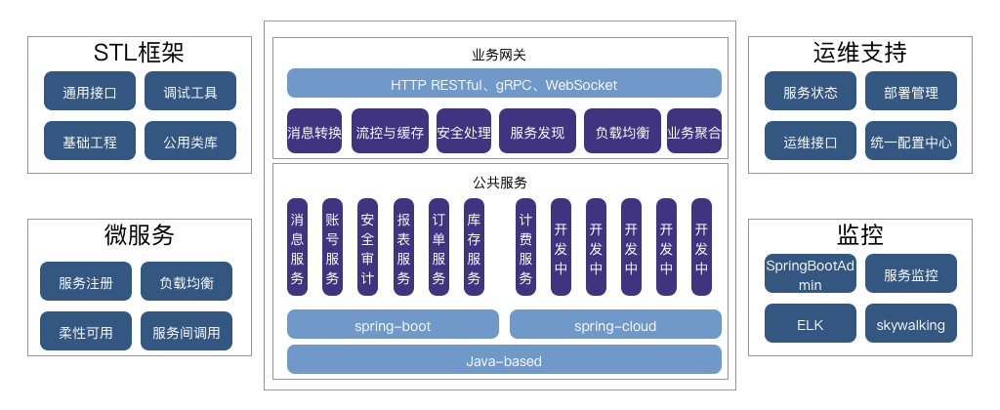
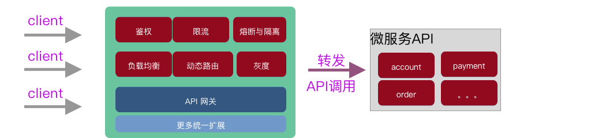
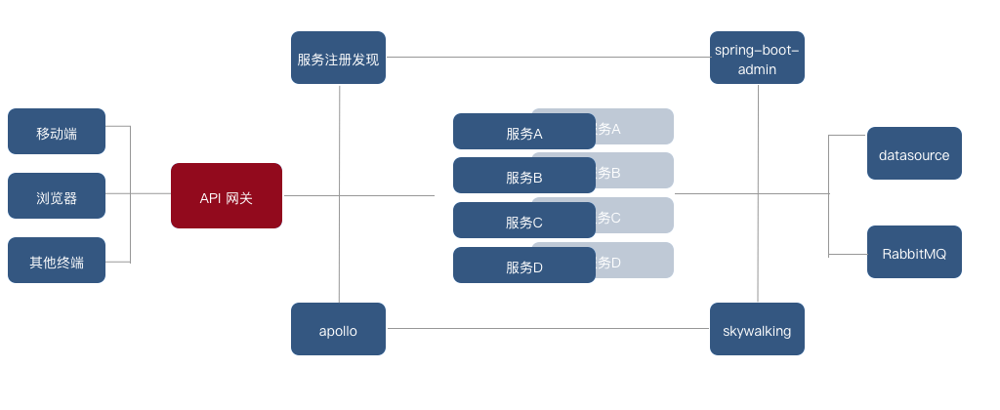
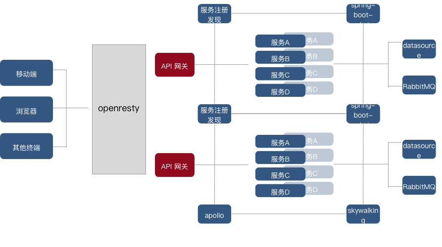

## 术语表：

名词|解释
------:|:-------
业务网关|整合业务API，分发给上游服务
流量网关|暴露在互联网、负责处理用户接入、分发给业务网关
代理|负责找到上游服务的角色
上游服务|提供实际业务的功能的服务器
waf|基于Web的安全防范
谓语|java8的一个类Predicates，负责封装判断逻辑
过滤器|处理请求过程，过滤器可以修改请求和响应等内容

## 摘要

本文描述对时下流行的API 网关实现进行研究和对比，选择符合当前公司应用的API 网关。

经过研究，我们得出结论： **Spring Cloud Gateway** 符合当前工程需求。关键因素：

1. 比zuul 1.x 性能提升15% 左右，与 zuul 2.x 性能相近，关键背靠 Spring 社区支持；
2. 附带的功能丰富，灵活度比zuul 系列高；
3. 后续的 **Road map** 清晰，开发社区庞大活跃，二开文档丰富。
4. zuul 最大能达到1000至2000的QPS，不适合高并发场景

在微服务体系中，我们目前技术架构如下：

通过这次选型，能够将这个架构更加完善。

下文将从具体的过程，来了解选型过程：

首先，我们通过 **API 网关** 章节我们来了解要选择的内容的类型区别；

其次，我们再将这些内容分别研究；

最终，输出对比清单，得出结论。

## API 网关

### 背景

微服务一般会有不同的网络地址，导致外部客户端可能需要调用多个服务的接口才能完成一个业务需求，

1. 客户端多次请求不同的微服务，增加了客户端的复杂性；
2. 存在**跨域**[^ref2] [^ref3] 请求，在一定场景下处理相对复杂；
3. 认证复杂，每个服务都需要独立认证;
4. 难以**重构**，随着项目的迭代，可能需要重新划分微服务。例如，可能将多个**服务合并**成一个或者将一个**服务拆分成多个**。如果客户端直接与微服务通信，那么重构将会很难实施;
5. 某些微服务可能使用了**防火墙 / 浏览器不友好**的协议，直接访问会有一定的困难。

以上这些问题可以借助 **API 网关**解决。

**API 网关**介于**客户端**和**服务端**之间，外部请求先经过**API 网关**再转到**服务端**。在这个过程**安全**、**性能**、**监控** 由 **API 网关**来做，从而提高了业务灵活性又不缺安全性。

以**API 网关**统一暴露微服务API后的优点如下：

1. 易于监控。可以在网关收集监控数据并将其推送到外部系统进行分析；
2. 易于认证。可以在网关上进行认证，然后再将请求转发到后端的微服务，而无须在每个微服务中进行认证；
3. 减少了客户端与各个微服务之间的交互次数。

这样的**API 网关**可以称作**业务网关**。

在微服务体系中，我们的服务间关系，归纳如下：

##  业务网关 与 流量网关

在笔者实际的网关实践有以下职能：

* **请求接入**，统一转发业务API；
* **业务聚合**，编码组装业务API，完成某业务需求；
* **代理能力**，实现安全、验证、路由、过滤、流控等功能；

而从架构角度划分类型，网关可以被定义成**业务网关** 与 **流量网关**

流量网关|业务网关
----:|-----:|
全局流量控制|服务级别流控（ratelimit）
日志access_log|服务降级与熔断（hystrix）
防SQL注入|路由、负载均衡（ribbon）、灰度策略
防Web攻击（waf）|服务过滤、聚合、服务发现
屏蔽扫描工具|权限验证
黑白名单|业务规则与参数校验
ssl证书|多级缓存策略

业务网关如何流量网关结合，归纳如下：

### 调优网关，主要关注点

在线上生产过程中，**API网关**的最重要的性能关注点：

1. 保持请求接入的能力
2. http多路复用能力提升

## 业务网关

1. 适配业务渠道
2. 适配通讯协议
3. 同步异步调用操作
4. 批量流程处理网关

目前Java 领域，有几个比较著名的实现： 

* zuul1
* zuul2
* Spring Cloud Gateway
* gravitee
* Dromara 

本文围绕  zuul1， zuul2， Spring Cloud Gateway具体做研究。

## 流量网关 

* nginx/openresty
* kong
* ingress/traefik

这部分网关，在互联网得到相当广泛的应用和认可，性能都很卓越，因此不需要做比较。不过就笔者个人熟悉nginx、openresty，建刚从这两者入手。

#### 网关在开源社区的活跃程度

**Spring Cloud**和**SOA**非常火，MSA（Micro Services Architecture 微服务架构）、**gRPC**、**Gateway**都有着非常高的关注度，通过**GitHub**的搜索来看，**Gateway**类型的项目也非常热门。

可以了解当前网关的实现热度： https://github.com/search?q=gateway&type=Repositories

但是考虑到技术语言栈、以及基础设施现有情况，我们这里选择基于java实现的网关，并且这些网关都是围绕**云原生**进行设计与构建的。

## Zuul2

Netflix 博客： Open Sourcing Zuul 2 提到 zuul2 的使用情况：

> The Cloud Gateway team at Netflix runs and operates more than 80 clusters of Zuul 2, sending traffic to about 100 (and growing) backend service clusters which amounts to more than 1 million requests per second

### 技术架构：

* Netty handlers 
* inbound filters
* outbound filters
* endpoint filters

**Netty handlers** on the front and back of the filters are mainly responsible for handling the **network protocol**, **web server**, **connection management** and **proxying work**。

* network protocol （代码）
* web server （代码）
* connection management （代码）
* proxying work （代码）

**inbound filters** run before proxying the request and can be used for **authentication**, **routing**, or **decorating** the request

* authentication
* routing
* decorating

**endpoint filters** can either be used to return a **static response** or **proxy** the request to the backend service （**origin**）

* static response
* proxy

**outbound filters** run after a response has been returned and can be used for things like **gzipping**, **metrics**, or **adding/removing custom headers**

* gzipping
* metrics
* custom headers

### 核心特性

来自 ： https://github.com/Netflix/zuul/wiki/Core-Features

* Service Discovery
* Load Balancing
* Connection Pooling
* Status Categories
* Retries
* Request Passport
* Request Attempts
* Origin Concurrency Protection
* HTTP/2
* Mutual TLS
* Proxy Protocol
* GZip

**Service Discovery** 可以与**eureka**无缝集成，也可以通过ribbon设定服务列表。

**Load Balancing** 使用ribbon的负载均衡能力，默认使用负载均衡器：**ZoneAwareLoadBalancer** 

**Connection Pooling** zuul2 creates a connection pool per host, per event loop。

* reduce context switching between threads
* entire request is run on the same thread, regardless of which event loop is running it.

One of the side-effects of this strategy is that the minumum amount of connections made to each back-end server can be quite high if you have a lot of Zuul instances running, with a lot of event loops in each. This is important to keep in mind when configuring the connection pool.

如此实现连接池的副作用，在多个zuul实例运行起来后，导致每个业务服务的连接数较大。

**Status Categories**  针对http 状态做了对照枚举，在类`StatusCategoryUtils` 可以查看。

**Retries** 重试功能是netflix 服务韧性的表现。根据以下情况重试：

* Retry on errors（**read timeout**, **reset connection** or **connect error**）
* Retry on status codes 

	1. If the status code is **503**
	2. 幂等请求重试（`GET`, `HEAD` or `OPTIONS`）

**Request Passport** 是一个调试工具，用于记录请求在zuul中的执行情况。

**Request Attempts** 是一个调试工具，用于记录请求的发起与相应状态。

**Origin Concurrency Protection** 业务服务器保护策略

### 如何基于zuul2 二次开发

目前zuul2 二次开放的教程相对较少，主要学习渠道需要从官方的github
https://github.com/Netflix/zuul  开始

### zuul2 比 zuul1 提升的性能

> zuul2 在 netflix 的应用类型是集中在采集客户端的日志，具有大量的写操作。在吞吐量应用上有25%的提升，CPU占用率下降25%。

以下都是对网关的评测：

官方的一份ppt分享，其中有一页提到性能zuul2 比zuul1 提升 15%左右。

https://www.slideshare.net/artgon/zuuls-journey-to-nonblocking

https://github.com/spencergibb/spring-cloud-gateway-bench

https://www.bytesville.com/zuul-spring-cloud-gateway-comparison-benchmarks-loadtesting/

https://engineering.opsgenie.com/comparing-api-gateway-performances-nginx-vs-zuul-vs-spring-cloud-gateway-vs-linkerd-b2cc59c65369

zuul 使用同步模型，缺点：

1. 线程上下文切换，过渡消耗cpu
2. 连接数受限
3. 阻塞会造成不稳定，抖动甚至崩溃

因此：zuul 适用于计算密集型(CPU bound 场景)， IO轻的场景；

任务：

1. java 如何模拟线程上下文切换造成的损耗？
2. 使用AsyncServlet servlet3.0支持异步请求

zuul2 使用非阻塞异步模式

编码设计上：引入事件、总线、队列机制，事件环处理，一个core上一个线程，线程开销少。 

缺点：

1. ThredLocal 无法使用，zuul2 中没有线程局部变量的支持。
2. 链路监控不容易集成

因此： 适用于IO密集型(IO bound) 场景

`zuul2的性能 比 zuul 提升不到20%`。在 netflix 公司认为投入与产出比不够理想。而作为我们目前选型，考虑业务的容易实现、生态链健全、运维开发方便为主，我们的io请求也不会很高。

可以集成Hystrix熔断，主动熔断防止同步阻塞，可以使用AsyncServlet servlet3.0支持异步请求，不是全程异步，只是前端异步可以支持很多连接数，但是后端保持单线程优点

## Spring Cloud Gateway

> This project provides a library for building an API Gateway on top of Spring MVC. Spring Cloud Gateway aims to provide a simple, yet effective way to route to APIs and provide cross cutting concerns to them such as: security, monitoring/metrics, and resiliency.

### 核心特性

* Project Reactor 响应式编程；
* Able to match routes on any request attribute.；
* Predicates and filters are specific to routes.；
* 能够与 Hystrix， resilience4j 集成；
* 与Spring Cloud DiscoveryClient 集成；
* 二次开发 Predicates and Filters 相当容易；
* 请求限流；
* 路径重写。

技术实现：

* Netty Nio
* Spring Webflux
* Project Reactor

关键术语：

**Route** ：定义一个route Id、一个目标uri、一个谓语（predicates）集合、一个过滤器集合（filters），route 是否生效需要谓语集合判断通过。

**Predicate**： 这是java8 函数式编程中的Predicate接口。用于判断 [ServerWebExchange](https://docs.spring.io/spring/docs/5.0.x/javadoc-api/org/springframework/web/server/ServerWebExchange.html) 是否符合条件

**Filter**： 可以通过过滤器修改请求和响应的内容。

架构图：

* 客户端访问gateway
* RoutePredicateHandlerMapping 匹配 route，route 传递到FilteringWebHandler中
* 在NettyRoutingFilter中进行路由代理
* 过滤器按照路由前后在逻辑上划分成**pre**和**post**。

### 如何基于 Spring Cloud Gateway

具体再另外一篇文章提供

## 网关对比

阅读 [^ref1]， 了解到当前作为API 网关的组件有以下4个：

* nginx （openresty)
* Zuul
* Spring cloud gateway

* 采用 Nginx 作为单体应用的网关

根据网关的类型，我们拆分成业务网关与流量网关的对比。

#### 作为业务网关的对比

特性|zuul|zuul2|Spring Cloud Gateway
---:|:-----|:-----|:-----
github star| 8.8k | 8.8 | 2.2k
发布时间| 早于2014 | 2018 | 2017
持续更新|停更|更新中（v3.0.0)|更新中
使用情况|大规模部署|大规模部署|未知
网络IO| 同步|异步非阻塞(netty)|异步非阻塞(netty)
服务发现|eureka|eureka|eureka、consul。。。
负载均衡|ribbon|ribbon|ribbon
与Hystrix熔断集成|是| 是|是
与Spring Cloud DiscoveryClient集成|是|否|是
请求限流|需自定义|需自定义|是
路径重写|需自定义|需自定义|是
连接池|否|支持|支持
重试|是|是|是
HTTP/2|否|支持|支持
TLS|支持|支持|支持
GZip|否|否|是
WebSocket|否|支持|支持
开发框架|web|webmvc|webflux

（Gzip 需要有底层的通讯框架提供，这里会一个疑惑，如果上游服务开启了这个功能，网关会怎么做？）

zuul 不用比了，因为已经有一版本实现，下面来看下zuul2 和 Spring Cloud Gateway 。

特性|zuul2|Spring Cloud Gateway
---:|----|:-----
star|8.8k|2.2k|
fork|1.7k|1.5k|
贡献者|39|79|
commits|808|1435|
release|55|41|
pr|8|26|
pr_close|284|312|
issue|158| 182 |
issue_clouse|267| 1024 |
bug|11（4 open）|114（11 open）|
wiki|有|否（独立管理）|
常规贡献者|9|16
代码质量||

#### 贡献者对比

* 贡献者中是否有行业意见领袖
* 现存bug是否十分严重
* 文档是否齐全

* zuul2 的代码贡献者 提交次数大于5、切修改行数大于100的有 `9` 位；
* Spring Cloud Gateway 的代码贡献者 提交次数大于5、切修改行数大于100的有 `16` 位

#### bug 反馈比

bug 反馈比 (应用广度的间接体现) 

bug / ( issue_clouse + issue )  * commits 

zuul ： 11 / (158 + 267)   =  `2.5%`

Spring Cloud Gateway : 112 / (182 + 1024) =  `9.2%`

结论： Spring Cloud Gateway当前在开源社区的活跃比 zuul2 高。

#### 请求限流

阅读：
zuul1 的限流方案：

http://www.itmuch.com/spring-cloud-sum/spring-cloud-ratelimit/

其中已经有一个开源工程：https://github.com/marcosbarbero/spring-cloud-zuul-ratelimit

Spring-cloud-gateway 限流方案：https://windmt.com/2018/05/09/spring-cloud-15-spring-cloud-gateway-ratelimiter/

#### 作为流量网关的对比

研究中 

特性|nginx|openresty|kong|ingress

参考：

1. [^ref1]:  https://www.infoq.cn/article/comparing-api-gateway-performances
2. [^ref2]: https://segmentfault.com/a/1190000017188296
3. [^ref3]: https://segmentfault.com/a/1190000011145364
4. [^ref4]: http://blog.itpub.net/31562044/viewspace-2651041/  
5. [^netflix-blog1]: https://netflixtechblog.com/zuul-2-the-netflix-journey-to-asynchronous-non-blocking-systems-45947377fb5c
6. [^netfilx-blog2]: https://netflixtechblog.com/open-sourcing-zuul-2-82ea476cb2b3
7. [^d]: http://blog.didispace.com/api-gateway-Zuul-1-zuul-2-how-to-choose/
8. [^ref5]: http://www.ityouknow.com/springcloud/2018/12/12/spring-cloud-gateway-start.html
9. [^ref6]: https://juejin.im/post/5aa4eacbf265da237a4ca36f
10. [^ref7]: https://www.jianshu.com/p/1c942a8abe18

